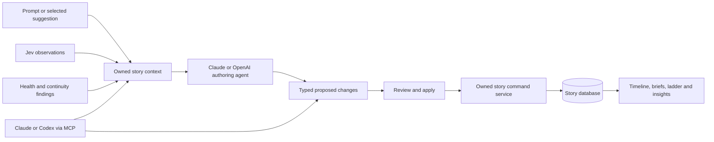

# StoryTool: prompt-driven authoring and provider connections

Implementation status, 2026-10-07: per-user encrypted connections, Claude/OpenAI
authoring, validated atomic proposals, history/undo, evidence-aware Jev feedback,
and a local Claude/Codex MCP bridge are implemented. See [AI_SETUP.md](AI_SETUP.md).
Provider calls require a user's saved API key. Model IDs are entered explicitly and
tested against the provider. The executor uses complete graph fingerprints and
Postgres advisory locks across story writes to prevent stale application.
Remote MCP OAuth/hosting, embedded agent runtimes, partial proposal application,
and background streaming/cancellation remain extensions. The sections below record
the design and original estimates. Documentation checked 2026-10-07.

## Recommended approach

Add an authoring agent that reads the story and calls typed StoryTool operations.
Users connect their own Anthropic or OpenAI API key in Settings. The same command
service should later be exposed through MCP, allowing Claude and Codex clients to
work on a user's story without a second implementation of story editing.

Start with Claude's Messages API and OpenAI's Responses API. Both support custom
tool calls that the application executes. Claude's existing SDK dependency makes
its initial provider adapter somewhat smaller. OpenAI is a second adapter over the
same story operations, not a second story engine.
[Claude tool use](https://platform.claude.com/docs/en/agents-and-tools/tool-use/overview),
[OpenAI function calling](https://developers.openai.com/api/docs/guides/function-calling).

## What already exists, and what must change

| Current component | Reuse | Gap |
| --- | --- | --- |
| Litestar CRUD routes and Pydantic schemas | Existing entities, fields, and relationship rules | No agent-facing command service or atomic multi-entity write |
| `domain/analysis.py` and `StoryGraph` | Story context and entity/edge lookups | Need compact, selected context rather than sending a whole manuscript every turn |
| `domain/timeline.py` | World-time and reading-order views | Populate events and scenes; the timeline is derived, not a separate object to generate |
| Readiness, health, and continuity engines | Check changes and explain remaining gaps | Preserve uncertainty; inferred mentions should not become proof of physical presence |
| `noticing/jev.py` | Typed judgments, confidence thresholds, deterministic evidence | Current suggestions do not retain the full observation, probability, evidence, or source revision |
| `noticing/claude.py` | Existing Anthropic client integration | Its schema and prompt explicitly prohibit generation; add a separate authoring agent |
| `noticing/factory.py` and `config.py` | Provider construction and fallback patterns | Keys and reader selection currently belong to the server, not individual accounts |
| Google users and ownership middleware | Account identity and HTTP story isolation | Internal agent operations need explicit ownership checks too; middleware alone will not protect direct service calls |
| Account menu and insights UI | Settings entry and feedback entry point | No Settings page, assistant panel, proposal review, or batch history yet |

The user's new instruction extends the original observation-only product design.
Keep observation and generation distinguishable: the reader reports what exists;
the authoring agent may propose content when the user asks it to.

## User experience

### Settings → AI connections

- Provider: Anthropic / OpenAI; model selected from the provider's available models.
- API key: masked entry, Connect/Test, Replace, and Disconnect.
- Separate optional TypeSafe/Jev connection for the reader. An Anthropic or OpenAI
  key does not authenticate a Jev account.
- Default authoring provider and model; optional automatic enrichment after a
  user-triggered noticing pass.
- Context choice: structure and selected scenes by default; whole manuscript only
  when needed for the requested task.
- Show connection status, last test result, and token usage for completed runs.
  Indicate that requests use the user's provider account.

Keep credentials on the backend, encrypted with a stable server-managed encryption
key. For local hosting that master key lives in an ignored environment setting;
keep it outside the database and source control. Never return saved plaintext keys,
put them in prompts, or store them in browser localStorage. Responses expose only
connection status and a masked suffix. Disconnect removes the stored credential.
Sanitize provider errors and logging so they cannot disclose keys or another user.

Use provider adapters with configurable model IDs. Validate availability through
the connection test; do not assume the current server's hardcoded model string is
valid for every user's account. The connection test should make clear whether it
uses a small billable request.

### Story workspace → Assistant

The user gives instructions such as:

> Build a five-beat mystery around this premise. Create its characters, locations,
> and events, then outline chapters. Reveal the theft near the ending, even though
> it happens before the opening scene.

The assistant reads the existing structure, creates a typed proposal, and displays
what would be added or changed: characters, acts, beats, threads, chapters, scenes,
events, places, relationships, and arc stages. It distinguishes invented material
from extracted facts and lists assumptions. It reuses existing entities when
appropriate rather than creating a duplicate protagonist or location.

Default flow: prompt → proposal → Apply → updated workspace. An explicit per-run
"Apply additions automatically" option can later support one-step population.
Deletion and prose replacement stay deliberate actions. Ordinary drafting keeps
working when the model is unavailable.

Show progress, cancellation, a readable completion summary, and the applied batch
history. Refresh the ladder, timeline, briefs, insights, and affected entity panels
after applying a change set. Count entities from actual committed results, not the
model's final response.

## The tool and execution layer

Keep the initial tool surface small:

| Tool | Purpose |
| --- | --- |
| `get_story_context` | Premise, mode, framework, existing entities, structure and revision |
| `get_scene_context` | Selected prose, scene links, cast and location |
| `get_timeline` | Event times, disclosure order, people and places |
| `get_story_findings` | Deterministic findings and evidence-bearing reader observations |
| `propose_story_changes` | Stage typed create/update/link operations and their explanation |
| `validate_proposal` | Resolve references, check ownership and calculate consequences |

Apply remains a backend command invoked by the user or an explicitly authorized
automatic run. Export these contracts for both providers and later MCP. Never give
the model an arbitrary SQL, shell, file-write, or general HTTP tool to author a story.

Operations cover every existing entity and the actual relationship tables. For
example: create a beat, link it to an act, create a chapter, assign a scene, attach
scene beats/threads/arc stages, and record event or scene participants. Arc ownership
uses the current typed character/relationship/thread fields, not a fabricated FK.

New entities use local proposal references, such as `new:maya` or `new:act-two`.
The application allocates UUIDs and resolves the dependency order. Models must not
invent existing UUIDs. Validate arguments with Pydantic, reject unknown operations,
and check every existing reference against the authenticated user's selected story.

Planning happens outside a write transaction. Applying a validated proposal uses
one transaction: either all connected entities and links commit, or none do.
Persist the proposed and applied operations, allocated IDs, and before/after values
for updates and links. Repeating an apply request with the same idempotency key
returns its existing result instead of inserting another set of beats.

Introduce a story revision and a shared write scope. All structural changes,
including manual UI changes, must lock/bump that revision. A proposal generated
against revision N cannot silently overwrite work made at N+1. Checking only the
Story row's current `updated_at` is insufficient: child edits do not currently
guarantee a change to it. Undo uses recorded inverse operations and checks that the
affected entities have not since changed; conflicts must preserve later manual work.

Timeline operations must keep two independent concepts:

- World time: event `sort_ordinal` and scene `story_time_ordinal`.
- Reading/disclosure order: chapter and scene `sort_key`, plus event→scene links.

Do not assign every event time zero when chronology is unknown. Allow unscheduled
events, matching unscheduled scenes, or explicitly propose a relative sequence.
Also distinguish listeners to a confession from people present at its historical
location. The Blue Carbuncle is the regression example for both distinctions.

## Better suggestions from Jev

Use a pipeline: deterministic checks + Jev judgments → persisted observations →
LLM editorial recommendations → optional proposed changes.

Add an observation record with story/scene IDs, source, judgment, probability,
evidence when available, and the source revision. Jev supplies probabilities;
literal snippets come from the input prose and deterministic matching, not from
invented model quotations. Keep uncertain readings labeled as uncertain.

The LLM receives the relevant observations together with the story's larger plan.
It can explain why something matters, offer two or three concrete options, and
produce an applicable proposal. For example, it can ask whether a missing scene
goal is already implied in the dialogue, needs a scene-detail update, or warrants
a later prose revision. Those are different changes and should stay selectable.

Each recommendation stores its supporting observation IDs, affected entities,
reasoning summary, priority, and proposed actions. Check that claimed observations
exist and refer to the supplied context. Treat creative alternatives as creative
alternatives, not established facts. Drop stale recommendations when their source
changes, and preserve dismissed suggestions and rejected mentions.

No LLM call is necessary to report a provable missing link or count scenes. Let the
LLM prioritize and explain findings. Bound the number of observations and excerpts
sent in one request. New recommendations should offer more value than merely
rewording the existing warning.

## Claude and Codex integration choices

There are two user-facing integrations: prompting inside StoryTool with an API key,
and working from an external agent that can call StoryTool tools.

| Integration | Estimated difficulty | Why |
| --- | --- | --- |
| Claude API in StoryTool | Low–medium after the command layer | Anthropic SDK already installed; add an authoring tool loop and per-user client |
| OpenAI API in StoryTool | Low–medium after the command layer | Add the client and Responses tool-call/result translation |
| Shared prompt-to-graph executor | Medium–high | References, batch validation, concurrent manual edits, retries and reversible changes |
| Claude/Codex clients using StoryTool MCP | Medium after the executor | Reuse the tools; add scoped agent credentials, transport and client setup |
| Embedded Claude Agent SDK or Codex SDK runtime | Higher operational burden | Process lifecycle, isolation, session storage and runtime configuration for each user |

For direct OpenAI API connections, label the provider "OpenAI." A provider key is
not automatically a user's Codex session. Codex's SDK is a separate runtime option;
official documentation describes both TypeScript and Python libraries, with the
Python SDK controlling a local app-server. Its process model adds infrastructure
that this app does not need for basic story generation.
[Codex SDK](https://learn.chatgpt.com/docs/codex-sdk).

Claude's Agent SDK is also distinct from the existing API client and can use custom
tools/MCP. Its documentation specifies API-key authentication for third-party
products unless otherwise approved; do not assume a user's claude.ai login can
back StoryTool's provider connection.
[Claude Agent SDK](https://code.claude.com/docs/en/agent-sdk/overview).

For external clients, publish a Streamable HTTP MCP server over the same commands.
Issue revocable StoryTool agent tokens bound to a user, allowed stories and read or
write scopes. A token identifies the StoryTool user independently of the client's
LLM provider key. Never reuse an administrator's browser session or give an external
agent access to every account. Codex supports MCP with bearer-token or OAuth
authentication; broader hosted/plugin access needs a proper delegated OAuth flow.
[Codex MCP](https://learn.chatgpt.com/docs/extend/mcp?surface=cli),
[OpenAI plugin authentication](https://developers.openai.com/plugins/build/auth).

## Implementation sequence and effort

These are engineering estimates for one developer familiar with this repository,
including integration tests and review. They are not guarantees or provider cost
quotes. The shared executor dominates the work; an SDK install is not the project.

| Step | Deliverable | Estimated focused effort |
| --- | --- | --- |
| 1 | Settings page, encrypted per-user connections, test/disconnect endpoints | 1–2 days |
| 2 | Owned command service, temporary references, atomic batches and revision checks | 2–3 days |
| 3 | Assistant panel, Claude authoring loop, proposal review and apply history | 1–2 days |
| 4 | Jev observation persistence and actionable editorial recommendations | 1–2 days |
| 5 | OpenAI adapter and provider parity tests | 0.5–1 day |
| 6 | External MCP tools, delegated tokens and Claude/Codex client testing | 1–3 additional days |

A useful in-app version is roughly one to two focused development weeks. Reliable
external-agent access follows it. Advanced undo after intervening edits and embedded
agent runtimes should be scoped separately rather than promised in the first demo.

Suggested new backend modules: `domain/ai/settings.py`, `credentials.py`, `tools.py`,
`commands.py`, `context.py`, `proposals.py`, `runner.py`, `providers/anthropic.py`,
`providers/openai.py`, and `controller.py`. Keep provider-specific SDK types out of
the command service. Reuse existing entity request schemas where practical.

Suggested persistence: `user_ai_connection`, `ai_run`, `ai_change_set`, and
`story_observation`, plus a story revision. Use JSONB for typed proposal/action
payloads, with actual user/story foreign keys on their containers. Add migrations
through the existing database workflow. Frontend additions: `/settings`,
`UserSettings`, `AuthoringAssistant`, `ChangeSetPreview`, and actionable insight cards.

## Acceptance tests

- A new-story prompt creates a connected graph, not just an assistant text answer.
- A follow-up prompt updates existing entities rather than duplicating them.
- The Blue Carbuncle's theft stays early in world time and late in reading order.
- Every generated timeline event can carry its people and location.
- An invalid reference or operation rolls the whole batch back.
- Cross-account story references and keys cannot be read or used by another user.
- Applying the same change set twice is harmless; stale proposals cannot overwrite edits.
- Reader guesses remain uncertain; rejected mentions and dismissed suggestions stay rejected.
- Provider errors, cancellation, and missing keys preserve the user's story and normal editing.
- Model or manuscript content cannot instruct the executor to read secrets or run arbitrary code.
- A second provider produces changes through the same validated contracts.
- External MCP tokens respect story scopes and revocation.

Start with settings and the shared command contracts, then implement Claude inside
the app. That creates the foundation for OpenAI and for both external agent clients.
