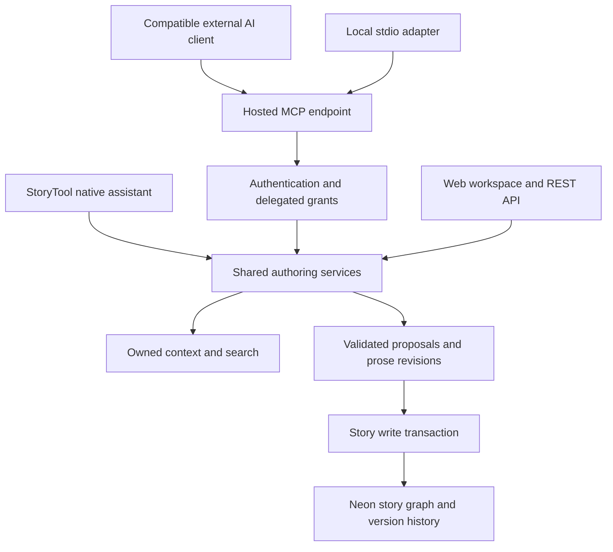

# StoryTool MCP server and writing workflows

Planning date: 8 October 2026. Status: full roadmap plus an initial implementation. The hosted token-authenticated server now includes the current entity/link catalog, staged prose replacement, findings/notices, arc tracing, version reads/comparisons/restores, guidelines and a full-catalog stdio adapter. OAuth onboarding and granular OAuth scopes are implemented using the official SDK, persistent grants, PKCE, refresh rotation, Google-backed story consent and revocation. Real-client rollout verification is ongoing. Forks, richer world/theme/lore models, range patches, durable workflows and novel-scale context optimizations remain planned. The API transport boundary is reused through in-process ASGI requests to preserve current ownership and atomic checkpoint behavior.

## 1. Product outcome

An author connects a compatible AI application to StoryTool, selects the stories it may access, and asks it to plan, draft, review, or revise. The agent can understand the existing story, propose connected changes, and apply authorized changes. Everything appears in the normal workspace and version history.

The server supplies context, constraints, operations, and writing workflow templates. The connected AI application supplies the model and executes the reasoning loop. MCP does not by itself run a model, pay for inference, or make a model capable of reliable tool use. A plain model API requires a host/orchestrator to execute calls. The native assistant should eventually use the same services.

Success means useful story work with preserved author intent. A filled outline and zero structural warnings do not prove that a story is effective.

## 2. Existing foundations and verified gaps

Reviewed files:

- `api/scripts/story_mcp.py`: local stdio MCP bridge with get_story_context, stage_story_changes, apply_story_changes, undo_story_changes.
- `api/src/storytool/domain/ai/commands.py`: entity schemas, story-owned references, new: references, transactional operations and inverses.
- `api/src/storytool/domain/ai/controller.py`: staging, validation, applied-run retry handling, stale-state checks, undo and story-scoped tokens.
- `api/src/storytool/domain/ai/context.py`: graph, schema catalog, health, continuity, fresh observations, optional bounded prose.
- `api/src/storytool/domain/versioning/`: full-state checkpoints, previews and recovery on restore.
- `api/src/storytool/domain/auth/access.py` and `db/plugin.py`: ownership, write locking and automatic checkpoints currently coupled to API requests.
- `AI_SETUP.md`: current local-client setup and documented limits.

The SDK is already locked to mcp 2.3.0. Keep that baseline until compatibility tests justify an upgrade.

Current limits:

1. No hosted MCP endpoint or remote authorization flow.
2. Four coarse tools; reading a whole graph and all schemas is wasteful for one scene.
3. SceneCreate/SceneUpdate do not accept prose content; structural proposals cannot draft prose.
4. Delegated tokens are limited to one story and the existing /ai/ API prefix. There are no granular read/prose/propose/apply scopes.
5. Model metadata for external proposals is generic; provenance needs improvement.
6. No first-class writing brief, durable work session, or resumable chapter workflow.
7. No focused MCP resources, writing prompt catalog, or MCP-level contract test suite identified.
8. A new /mcp route would bypass current API-path authentication and checkpoint hooks unless explicitly integrated. This is the most important implementation trap.

Retain the valid executor, ownership checks, graph diagnostics, existing UI and versioning. Refactor their transport-dependent boundaries rather than creating another mutation engine.

## 3. Architecture

Proposed public endpoint: `https://storytool.onrender.com/mcp`. This URL is a design target, not a deployed MCP endpoint yet.

Use the official Python SDK and Streamable HTTP, mounted as an ASGI application alongside the existing Litestar app. Do not replace Litestar or introduce a separate service initially. Verify routing, middleware boundaries, startup/shutdown, exception handling and SDK lifespan integration in a small first milestone.

One adapter uses HTTP; another retains stdio for local clients. Both expose the same tool definitions and domain behavior. Keep the existing local configuration working during migration.

Use SDK-supported protocol negotiation and test both current and older supported clients. The July 2026 protocol changed sessions and HTTP behavior; avoid copying a pre-2026 SSE tutorial into this app.

Domain writes must use a transport-independent transaction service that authorizes ownership and capabilities, acquires the per-story lock, checks the reviewed revision, applies mutations, saves checkpoints, records the audit result and commits atomically. A failure in any part rolls back all story changes. Existing REST and MCP paths must pass the same fault-injection tests.

Never hold a transaction or story write lock while the external model thinks, while the author reviews, or while a provider generates text.

## 4. Connection and permissions

Default connection scope: one selected story. Multi-story grants are explicit, with a list of allowed story IDs. A list_stories response only lists allowed stories, even if the account owns more.

Capability design:

| Capability | Allows |
| --- | --- |
| story:read | Structure, summaries, timelines, health and non-prose context |
| prose:read | Selected draft text and authorized textual evidence |
| changes:propose | Stage structure or prose changes, without applying |
| changes:apply | Apply changes allowed by the grant and approval policy |
| versions:read | Version metadata and authorized previews |
| versions:create | Create named checkpoints |
| versions:restore | Restore an explicitly approved whole-story version with a recovery checkpoint |
| story:fork | Create an authorized separate working copy from a selected version |
| findings:curate | Confirm/reject inferences, dismiss/reopen notices, and add author explanations |
| story:create | Optional future creation of a new story; absent from single-story grants |

Prose-bearing previews and old versions require prose:read. Scope enforcement must happen in services, not only tool discovery. A client calling an undisclosed tool directly still gets denied.

Preset UI: Review only; Suggest edits; Authorized writing. Grant author, selected story, expiry, capabilities and revocation are stored server-side. Client-provided identity and an `approved=true` tool parameter are never proof of authorization.

Phase A: support existing personal agent tokens and add capability constraints. This enables stdio and HTTP clients that support bearer headers. Call this a token-authenticated beta, not universal OAuth compatibility.

Phase B: implement standards-based remote OAuth. The author uses their existing Google-backed StoryTool login at the consent screen, chooses stories and capabilities, then grants access. Google authenticates the person; StoryTool or a vetted authorization-server integration issues access tokens intended for the MCP resource. Do not send Google ID tokens as MCP bearer tokens and do not expose model-provider keys.

The OAuth milestone includes protected-resource and authorization-server discovery, authorization code with PKCE, validated redirect URIs, resource/audience restrictions, short-lived access tokens, appropriate refresh rotation/revocation, issuer validation, and compatibility testing for client registration. Use a maintained implementation and complete conformance checks; OAuth is a separate workstream from tool decorators.

Origin validation, authenticated calls, secret redaction and authorization on every resource read are required parts of publishing a private server. Do not add a broad CORS wildcard to make connection problems disappear.

## 5. Author control

Default: read, reason, stage, show changes; applying requires a recorded user approval or an already authorized bounded workflow.

The author should not approve every individual beat. Offer a workflow grant such as: outline Act 1 and draft three new scene placeholders; do not rewrite existing prose, delete items, or change the ending. Persist these bounds and enforce them server-side.

A proposal records both requested intent and assumptions. Alternatives remain alternatives until chosen. A rejected proposal stays rejected. Author-confirmed decisions are distinguished from tentative ideas and reader guesses.

Approve against an immutable proposal digest, base story revision, actor and grant. If the proposal is edited, approval becomes invalid. Partial selection must include its required create/link dependencies or explain what is missing.

Read-only, propose-only and authorized-write behavior should be visible in both the client tools and the app connection screen.

## 6. Context designed for novels

Use progressive reads:

1. Story overview: premise, theme, mode, framework, brief, counts, major turning points, current revision.
2. Filtered entity lists: act, chapter, scene, thread, character, place; pagination and stable ordering.
3. Scene brief: POV, want/need, arc stage, goal/conflict/outcome, chapter obligations, thread, setting, prior outcome, next setup and temporal position.
4. Targeted prose: full requested scene through bounded chunks, never a silently truncated whole-novel payload.
5. Diagnostics: deterministic problems separately from model judgments, including stale status and evidence references.
6. Search: database-backed text and metadata filters first. Add embeddings only if usage proves they help.

Each response includes story_id, relevant entity IDs, revision, returned fields, prose inclusion, truncation flag and cursor when needed. Default lists exclude prose. Initial suggested bounds: 50 list rows and 8,000 characters per prose chunk; these are product settings to tune, not promises of token counts.

Use query projections and bounded evidence reads. Do not select every scene's content merely to return an outline. Cache only with identity/grant/story/revision in the key, with private resource cache scope. No shared prose cache across users.

Health or continuity checks may need the complete internal graph; the client response can still be compact.

## 7. Tools

Start with a small, stable tool catalog. The precise names can change once usability is tested.

| Tool | Inputs and useful output |
| --- | --- |
| get_capabilities | Allowed stories, granted scopes, schema/tool version, transport capabilities, limits |
| list_stories | Allowed library summaries; cursor |
| get_story_overview | Story ID; premise, brief, structural summary, revision |
| query_story_entities | Story, entity kind, filters, cursor; typed rows and IDs |
| search_story | Story, search text, field filters; bounded matches, evidence when permitted |
| get_scene_context | Story and scene; computed writing brief, adjacent scene summaries, optional permitted prose |
| get_timeline | Story, world/reading order, filters; people, locations, on/off-page events, unresolved positions |
| get_arc_trace | Character, relationship or thread; stages and linked scene evidence |
| get_story_diagnostics | Health, continuity, fresh observations, dismissed findings, clear severity and provenance |
| stage_structure_changes | Typed batch with expected revision, intent, rationale and idempotency key; stored proposal and summary |
| stage_prose_changes | Scene replacement or checked-range patches; prose diff, revision requirements, assumptions |
| inspect_proposal | Proposal details, paginated before/after diff, dependencies and diagnostics delta |
| apply_proposal | Immutable proposal, approved selection, idempotency key; result IDs, revision, checkpoints, changed entities |
| dismiss_proposal | Proposal; dismissed status, no graph mutation |
| undo_proposal | Applied proposal; reversible result or conflict when later work would be overwritten |
| Version tool group | List, read, create, compare and preview; guarded restore and fork with explicit capabilities and approval |

Resources and prompts supplement these tools. All essential operations also have a tool entry because clients vary in how they expose resources and prompts.

Create schemas are discoverable and versioned, but ordinary reads should not repeat the entire schema catalog. Typed entity-operation unions replace a completely open data dictionary as the public contract. Include readable tool titles, concise descriptions, output schemas and appropriate read-only/destructive/idempotent annotations. Annotations guide clients; server checks enforce permissions.

Errors include a stable code, actionable message, field path/operation index, retryable flag, current revision if permitted and no_changes_applied. Initial codes: forbidden_scope, story_not_found, invalid_reference, invalid_fields, stale_revision, approval_required, proposal_superseded, undo_conflict, request_too_large, temporary_unavailable.

## 8. Editing prose

Prose is a dedicated operation, because the current structural schemas intentionally exclude scene.content.

Support full replacement for new or short drafts and checked-range patches for focused revisions. Each operation includes scene_id, base_content_hash, replacement content or patches, reason and requested change boundaries. Specify offset units consistently with the frontend; reject overlapping patches and stale anchors. Never fuzzy-apply to text that changed after review.

The executor recomputes word count, captures the previous prose revision, runs the existing annotation reconciliation behavior, marks reader observations stale, and records a before/after story checkpoint. Confirm that these behaviors are shared with the manual prose save service rather than reimplemented inconsistently.

UI previews show prose diffs as prose, with metadata changes separately. A tool can draft an optional alternative without replacing the accepted version. Later, promote useful alternatives into branch/fork workflows; the first release can use proposals and named versions.

Deletion of existing entities stays out of the initial general write tool. Whole-story restore is a dedicated version tool with its own capability, impact preview and approval; it is never an ordinary entity update.

## 9. Timeline semantics

There are at least two orders: what happened in the fictional world, and when readers encounter or learn about it. Current fields support world ordinals and scene/chapter reading order; do not conflate them.

For The Blue Carbuncle, a theft can precede the opening in world time while being revealed near the end. An agent must not move the theft itself to the ending because the confession appears there.

Expose event occurrence, on/off-page status, linked scenes, people and locations. Preserve unknown time as unknown, not ordinal zero. Keep flashback markers meaningful and allow intentionally unplaced events.

A gap worth investigating: one scene_id cannot fully express an event being mentioned, witnessed and explained in multiple scenes. Plan an event_scene_revelation link with relation types such as occurs, mentioned, recalled, explained. Add it only after reviewing the existing timeline representation; keep current links compatible. This is a writing-model enhancement enabled by MCP work, not a protocol requirement.

Also distinguish what the reader knows from what individual characters know. Initially record bounded story decisions/notes; a full knowledge-state engine is a later feature, not a prerequisite for the server.

## 10. Resources and prompts

Private resource templates could include:

- storytool://stories/{story_id}/overview
- storytool://stories/{story_id}/brief
- storytool://stories/{story_id}/scenes/{scene_id}/context
- storytool://stories/{story_id}/timeline
- storytool://stories/{story_id}/diagnostics

These are MCP identifiers, not public website URLs. Reading an identifier requires the same grants as calling the corresponding tool. Resource listing cannot reveal private story titles to unauthorized clients.

Prompt templates: develop_premise, build_connected_outline, discover_structure_from_scenes, draft_scene, revise_scene, repair_timeline, strengthen_character_arc, review_story, continue_chapter.

Each specifies expected reads, author questions, artifact scope, quality checks and how to stage changes. Prompts suggest a workflow; the server does not assume the client follows them. Expose equivalent instructions through a tool for clients without a prompt picker.

## 11. What makes the writing effective

Capture an optional author brief: intended audience, genre/subgenre, thematic question, POV/tense, length goal, tone, desired ending, stylistic preferences, constraints, author-confirmed canon and unresolved questions. Persist it as authored state with versioning. Request only decisions needed for the current task; don't force a large setup questionnaire.

Workflow:

1. Understand the requested scope and existing canon.
2. Identify pivotal missing decisions and offer a few useful alternatives.
3. Build causal turns and stakes rather than just inserting named framework beats.
4. Trace character choices and costs through the plot.
5. Build a connected outline appropriate to the selected mode.
6. Draft scene by scene with adjacent context and explicit purpose.
7. Review causality, continuity, POV, voice, pacing and setup/payoff.
8. Revise narrowly, stage the result, explain tradeoffs, then apply within authorization.

Deterministic validation can prove ownership, links, valid schemas and defined temporal contradictions. Editorial judgments such as weak motivation or flat voice need quoted evidence, confidence, caveats and alternatives. Never reduce literary quality to one automated score.

Respect writing mode: plotter follows readiness/scaffolding; hybrid allows incomplete structure and placeholders; pantser can draft first and suggest inferred links without pretending they are confirmed. Hard technical errors remain errors in all modes, while incompleteness remains a visible creative state.

No built-in tool should simply call a model with 'write a good novel' and claim completion. The external client performs the creative reasoning; the server supplies trustworthy context and verifiable changes.

## 12. Sessions, proposals and audit

Durable domain sessions are explicit IDs, not shared module-level selected-story variables or protocol connection state. Session records store owner/grant, story, intent, bounds, base revision, accepted decisions, unresolved questions, completed artifact IDs, next step and status.

Reuse AIRun initially for proposal compatibility, then decide whether clearer Proposal models are justified. Add origin (external MCP/native/web), client-supplied display metadata marked unverified, grant/session IDs, tool name, operation counts, prose-change flag, checkpoints, approval digest and timestamps. Do not treat a claimed client/model name as authorization evidence.

An idempotency key is bound to actor/grant/story/tool and request hash. Replaying the same request returns its existing result; reusing the key with different content fails. Database constraints enforce uniqueness. Retry after a dropped connection cannot create duplicate chapters or apply patches twice.

Persist only the decisions and artifact references needed to resume, not hidden model reasoning. Audit errors without tokens or full prose. External-client conversation history is not automatically available to StoryTool; request summaries explicitly when needed.

Whole-story restore invalidates graph-bound proposals and active workflow revisions. Existing superseded-run behavior must extend to new proposal/session types.

## 13. App experience

Settings becomes an AI clients/Connections area: endpoint, chosen client instructions, selected stories, capabilities, expiry, status, last use and revoke.

The author sees a consent page for remote clients. Provider key settings stay separate; connecting an external client does not require entering another LLM API key in StoryTool.

Each story gets an agent activity view: requested task, client display name, proposed/applied state, short change summary, affected characters/beats/events/scenes, prose preview, review/apply/dismiss, and checkpoint links. Use the same preview components for native and MCP proposals.

A bounded workflow can show 'Outline approved; drafting scene 2 of 3' from explicit session updates. Do not pretend to know what an external model is doing between calls.

Refresh the workspace when the browser regains focus or on modest activity polling. Later add subscriptions where client/server capability and hosting behavior are proven.

## 14. Hosting and reliability

Initially use the existing Render service and Neon database. Persist grants, proposals, work sessions and idempotency receipts in Postgres. Neither the filesystem nor process memory is durable on this host.

Prefer short tools that read, stage or apply stored artifacts. Model thinking belongs in the external client; an open MCP HTTP request should not be needed for a full chapter generation.

Render's free service can sleep after 15 minutes and take about a minute to wake. Beta setup must distinguish waking/unavailable from bad credentials and document realistic retry behavior. Do not promise always-on MCP reliability on this plan. An always-on tier is a later cost decision for regular users, not required to prototype.

A native background writer requires durable jobs and a worker/lifecycle design; this is separate from publishing a useful MCP endpoint. No invisible daemon executing an entire novel in a free web-process background task.

## 15. Implementation sequence and release gates

| Phase | Work | Gate |
| --- | --- | --- |
| 0: contracts | Inventory schemas, authorization boundary, SDK mount and current client behavior | SDK handshake/discovery and one authenticated read work locally and on hosted staging |
| 1: shared safety | Extract principal/grants and story-write transactions; keep REST behavior | Ownership, atomic rollback, stale-state, idempotency and checkpoint parity tests pass |
| 2: useful remote beta | Streamable HTTP, stdio parity, focused read tools, typed structure proposals | Authorized client can build a linked outline; another user/story remains inaccessible |
| 3: prose workflows | Scene briefs, draft/revision staging, prose diffs, revisions and annotation handling | Draft/revise a scene safely; author text survives conflicts, retries and undo |
| 4: remote onboarding | OAuth, consent, grant management and tested client registration | Two real clients connect through browser authorization, revoke and reconnect correctly |
| 5: writing depth | Brief, prompt library, resumable tasks, arc/timeline views and editorial evidence | End-to-end short-story and nonlinear-story scenarios meet author and technical rubrics |

Phases 2 and 4 distinguish a usable bearer-token beta from a broadly connectable public integration. Do not call the latter complete before real OAuth clients pass.

Estimate, assuming the current codebase and one focused developer: roughly 5-8 working days for contracts, shared transactions and a token-authenticated structural beta; 4-7 more for prose workflows and review UI; 5-10 for OAuth and client interoperability; 4-8 for durable writing workflows and evaluations. Approximately 3-6 weeks for a credible broader release, with OAuth/client behavior the largest uncertainty. These are planning estimates, not delivery commitments.

Defer separate microservices, vector databases, autonomous multi-agent teams, automatic publication, arbitrary shell/file/network access, rich MCP widgets, and whole-novel unattended generation. None is needed to validate the central writing workflow.

## 16. Verification

Protocol: SDK and Inspector discovery, tool/resource/prompt lists, structured output, supported revisions, malformed calls, lifecycle, cancellation and restart.

Authorization: user A/user B isolation; story-subset grants; prohibited prose in resources, previews, search and historical versions; expired/revoked tokens; direct calls to hidden tools; invalid origins; OAuth redirect/PKCE/audience/refresh behavior.

Transactions: invalid second operation rolls back the batch; checkpoint failure rolls back the edit; same idempotency key can't duplicate scenes; story edits invalidate stale plans; race between two applies commits at most once; undo preserves subsequent edits.

Prose: content hash mismatch, overlap/offset handling, preserved author text, correct word count, prose revisions, annotation effects and stale reader observations. An unavailable external model never damages the story.

Writing fixtures: Blue Carbuncle occurrence vs reveal order; Red-Headed League misdirection and causal links; Last Lantern linked character stages and tutorial scene; an original small story from premise through draft and revision; pantser prose-first discovery. Treat seeded adaptations as structural fixtures; evaluate voice and literary quality on author-reviewed original text.

Novels: hundreds of scenes, bounded context, correct pagination, no prose overfetch, no incomplete-result masquerading as complete. Assess query counts, latency, output size and cold-start behavior before choosing performance thresholds.

Compare multiple tool-capable models on the same tasks: schema validity, tool selection, retries, unsupported fields, missing links, voice preservation and useful revision rationale. Model-specific success must not become a promise that every LLM behaves equally well.

## 17. Standards and sources checked

- [Official Python SDK](https://py.sdk.modelcontextprotocol.io/): implementation baseline and supported protocol behavior.
- [Streamable HTTP](https://modelcontextprotocol.io/specification/2026-07-28/basic/transports/streamable-http): endpoint, origin validation, metadata and version compatibility.
- [MCP authorization](https://modelcontextprotocol.io/specification/2026-07-28/basic/authorization): OAuth roles, discovery, resource-bound tokens and registration mechanisms.
- [Tools](https://modelcontextprotocol.io/specification/2026-07-28/server/tools): tool contracts and structured outputs.
- [Resources](https://modelcontextprotocol.io/specification/2026-07-28/server/resources): private contextual data and templates.
- [Prompts, older supported specification](https://modelcontextprotocol.io/specification/2025-11-25/server/prompts): reusable user-selected workflows; final current SDK behavior must be verified during implementation.
- [MCP Inspector](https://modelcontextprotocol.io/docs/tools/inspector): interoperability and protocol verification.
- [Render free-service limits](https://render.com/docs/free): idle sleep, startup delay and ephemeral filesystem.

The recommended first deliverable is a hosted, authenticated, story-scoped server with focused context reads, validated connected-outline proposals, app review, transactional apply and version recovery. Add prose and OAuth to make it a complete external writing integration.

## 18. Complete entity and relationship capability catalog

The target is complete authored-state coverage, not only a beat generator. The server returns current field schemas, allowed enums, required and optional fields, reference types, examples, validation limits and schema version through get_entity_schema and get_connection_guidelines. Inputs never let an agent set ownership or audit fields.

| Entity | Existing authored fields to support | Links and meaning |
| --- | --- | --- |
| Story | title, premise, genre, pov_style, structure_framework, authoring_mode | Root of all owned entities. Status/completeness is derived. Creating a new story needs story:create. |
| Character | name, role, wound, misbelief, want, need, arc_type, voice_notes | Owns a character arc; may own threads; supplies POV, presence and event participants. |
| Relationship | character_a_id, character_b_id, history, current_dynamic, tension_notes | Two distinct characters; can own an arc. Its change belongs in that arc and linked stages. |
| Arc | exactly one of character_id, relationship_id, thread_id; resolution | An ordered progression, not a synonym for a plot beat. Exactly one owner is a technical constraint. |
| Arc stage | arc_id, label, description, sort_key | A particular change/state linked to evidence scenes through scene_arc_advance. |
| Act | number, title, summary, emotional_shift_from/to, opening_turning_point_id, closing_turning_point_id, sort_key | Belongs to story; contains beats and chapters; opening/closing events are real events. |
| Beat | label, description, act_id, framework_position, sort_key | A structural obligation fulfilled by chapter_beat and scene_beat links. Fulfillment is derived from the graph. |
| Thread | type, title, owner_character_id, sort_key | A-story/B-story/C-story/throughline; advances through scene_thread. A scene can carry multiple threads. |
| Chapter | number, title, summary, act_id, pov_character_id, emotional_shift_from/to, status, sort_key | Contains ordered scenes and chapter_beat links; chapter context is computed. |
| Scene outline | title, type, chapter_id, summary, location/location_id, story_time_ordinal, time_label, is_flashback, pov_character_id, goal, conflict, outcome, emotional_value_from/to, status, sort_key | Links to beats, threads, character presence and specific arc stages. Outline and prose are different editing operations. |
| Scene prose | content through a dedicated prose operation; base content hash; approved patches/replacement | Previous text saved as a prose revision; word_count computed; annotations reconciled. |
| Event | label, description, sort_ordinal, display_label, is_turning_point, is_on_page, scene_id, location_id | Represents what happened in the world; event_character adds participants. World ordering is not disclosure ordering. |
| Location | name, description, atmosphere_notes, sort_key | Reused by scenes/events so continuity can inspect a stable place ID instead of ambiguous free text. |
| Annotation | scene, text range, quoted_text, note | Author/agent comments attached to permitted prose; stale annotation behavior follows existing services. |
| Version | number, label, source, timestamp, statistics, snapshot format and state | Immutable saved story graph; owner remains the current owner on restore. |

Controlled values come from the application's enums: roles protagonist/antagonist/mentor/foil/supporting; arc types positive/negative/flat; thread types a_story/b_story/c_story/throughline; scene types scene/sequel; draft states placeholder/outlined/drafted/revised. Never invent enum values such as villain, love_interest or hero_journey when the schema does not accept them. A descriptive role can live in authored notes until the vocabulary is deliberately extended.

Current framework choices are three_act, save_the_cat and custom. The original brief mentions Hero's Journey, but it is not currently an accepted framework enum. Guidance can map it to custom; a first-class framework is a separate schema and scaffolding change.

The original brief's separate Theme and World containers, lore entries and structured world rules are not currently implemented as full entities. Add author-brief/theme/world-rule/lore models deliberately if included in the complete writing product, with ownership, schema discovery, version coverage and UI editing. Until then, store clearly labeled brief/notes, never pretend unsupported fields already exist.

Explicit link catalog:

| Link | Supported cardinality and purpose |
| --- | --- |
| Act -> opening/closing Event | Optional anchors; a shared boundary event may close one act and open another. |
| Beat -> Act | Nullable owner during discovery. |
| Chapter -> Act | Nullable while outlining; context derives from this owner. |
| Scene -> Chapter | Nullable for unattached discovery scenes; moving changes reading order. |
| Chapter <-> Beat | Many-to-many; a chapter can advance several obligations. |
| Scene <-> Beat | Many-to-many; several scenes may collectively fulfill one beat. |
| Scene <-> Thread | Many-to-many with optional primary thread; advancing a subplot does not require a separate scene. |
| Scene <-> ArcStage | Many-to-many; show the actual choice/change evidenced by each link. |
| Scene <-> Character | Presence, with manual/confirmed/inferred/rejected state handled explicitly. Presence is distinct from POV. |
| Event <-> Character | World-event involvement, which can exist without an on-page scene. |
| Scene/Event -> Location | Structured optional place; place descriptions do not substitute for these references. |
| Relationship -> Character pair | Distinct endpoints in the same story; relationship arc owned through relationship_id. |
| Arc -> exactly one owner | Character, relationship or thread, with ordered stages. |

Chapter thread membership, beat fulfillment and current story status should be derived where the app already derives them. Do not add redundant stored chapter.thread_ids or beat.is_fulfilled flags without a reason and synchronization design.

Stage create/update/link/unlink/move operations using typed schema variants and real IDs or new: references. The executor resolves dependencies, allows placeholders, and tells the model which incomplete details remain. A general single-entity convenience tool can stage a small proposal for weaker models. Larger builders can accumulate an isolated draft proposal across calls; incomplete draft builders cannot apply until references and the complete dependency graph validate.

An additive plan must first search for existing named entities and relationships. Do not create a second Maya because context omitted her ID. Alias matching may suggest candidates, but ambiguous identity requires clarification rather than automatic merges.

## 19. Full version workflows through MCP

| Tool | Contract |
| --- | --- |
| list_story_versions | Paginated metadata, automatic/named/recovery/restore source, counts and labels; does not transfer every snapshot. |
| get_story_version | Read selected entity kinds/scenes from one immutable snapshot with the same story/prose permissions as current data. |
| create_story_version | Save a named whole-state checkpoint using expected revision and idempotency; return immutable version ID. |
| compare_story_versions | Two saved versions or one saved/current revision; paginated entity/link/prose differences with redaction. |
| preview_version_restore | Compute additions, removals, updates, affected scenes and changed prose; return preview digest and current revision. |
| restore_story_version | Consume authorized approval bound to preview digest/version/current revision; create recovery, restore atomically and checkpoint result. |
| fork_story_version | With story:fork capability, produce an independent owned story with remapped IDs and provenance; needs implementation beyond current stored parent_story_id. |

Reading a version supports prompts such as 'Compare Maya's motivation before and after the Act 2 rewrite' and 'Use v5 as context, but propose edits against my current draft.' Snapshot context always identifies its source; an old version is never mistaken for the writable current state.

Restoring covers prose, structure, timeline, arcs, people, places, notes and links together. It preserves ownership and excludes credentials, connection grants and client conversations. The current draft must be captured in a recovery version. A concurrent author edit invalidates the preview. The client receives new revision, recovered/restored version IDs, invalidated proposals/sessions and refresh instructions.

Forking is the preferred future workflow for testing a substantially different ending without replacing the main story. The new story has independent permissions: a single-story agent grant must not silently gain access to the fork. The author authorizes the destination or extends a grant through consent.

Never delete a version because the model says it is outdated. Retention follows application policy; recovery history remains visible. Author-created brief/theme/lore models must be added to snapshot capture/restore before those fields ship.

## 20. Reading and curating issues, notices and observations

Expose separate typed collections, plus a combined summary for the agent's first read:

1. Completeness and readiness: missing fields, placeholders and blocked/scaffolded levels.
2. Health findings: structural gaps with code, severity, level and affected entity.
3. Continuity contradictions: graph facts, such as conflicting structured world-time/location references.
4. Possible continuity anomalies: uncertain findings, with confidence and scene evidence.
5. Reader notices/suggestions: source, subject, related character/scene/thread, dismissed state and timestamps.
6. Reader observations: payload, source, source revision, related scene and fresh/stale status.
7. Inferred character mentions: discovered/confirmed/rejected provenance; author decisions preserved.
8. Author annotations and comments: ranges/quotes only when prose permission permits.

Tools: list_story_findings with category/status/entity filters; get_finding_context for affected graph and permitted evidence; get_reader_observations with revision freshness; get_character_mentions; stage_finding_decisions; record_editorial_review. A review-only grant can read permitted findings but cannot dismiss or confirm them.

Unify results with a presentation envelope, without pretending their original schemas are identical: category, stable ID or deterministic finding key, code, severity, claim type, subject IDs, source, confidence when available, evaluated revision, stale flag, dismissal state and allowed actions. Deterministic transient health findings get a key derived from code/subject/revision, not a fabricated database row ID.

External agents can suggest a repair for a notice by referencing its ID and the current story. A fresh diagnosis is read again after applying; success is reported only if the original problem is now resolved. A dismissed warning is not the same as a solved warning. Fixing structure must not require changing prose unless the author requests it.

Examples:

- 'Act 2 has no midpoint' -> inspect act, framework and existing scenes; offer an existing turning point to link before inventing a new subplot.
- 'Character arc has no advancing scenes' -> look for a demonstrated choice; propose a stage link if the text supports it, or a targeted scene revision if it does not.
- 'Five scenes have no beat' -> distinguish deliberate atmosphere/transition from disconnected action; propose justified links, not arbitrary labels to silence the report.
- 'Possible location contradiction' -> check structured time, flashback markers and evidence; ask if the author intends simultaneity before changing world chronology.
- 'Reader found a character six times' -> suggest a character profile only if this is a recurring person; respect rejected mentions and name ambiguity.

Refreshing external reader observations may call a configured paid provider. Reading stored observations must not silently trigger it. An explicit optional reader:run capability and author confirmation disclose provider/prose/cost behavior. Deterministic rereads remain inexpensive local operations. Editorial reviews supplied by the connected client need no StoryTool provider key.

## 21. Writing guidelines as discoverable product data

Provide versioned original guidance through get_writing_guidelines(topic, framework, genre, depth) and get_connection_examples. Also expose MCP resources/prompts, with tools as the compatibility fallback. Each guideline includes its purpose, applicable context, entity/field mapping, worked example, common failures, alternatives and source attribution. A guideline is advice, not a database constraint.

Useful initial guidance packs:

| Approach | App mapping | What to avoid |
| --- | --- | --- |
| Three-act causal structure | Setup/commitment, escalation/reversal, consequential resolution -> acts, turning events and beats | Treating any exciting incident as a midpoint, or assuming every story needs exact page percentages. |
| Save the Cat | Named beat obligations and A/B-story interaction -> framework_position, acts, scene/thread links | Enforcing screenplay timing as a hard novel rule, or filling labels without causal consequences. |
| Snowflake development | Expand premise into plot summary, character motivations and scene list -> progressive scaffold | Requiring every discovery writer to complete a long planning sequence. |
| Want/need character arcs | External goal, misbelief, internal need, ordered choices -> character, arc stages, evidence scenes | Equating a wound with a flaw, or forcing want and need to be opposites in every story. |
| Scene/sequel rhythm | Goal/conflict/outcome, then reaction/dilemma/decision -> scene type and linked next scene | Making every scene a catastrophe or requiring one discrete sequel after every action scene. |
| Setup/payoff and mystery disclosure | Clues, earlier events, reveal scenes, later consequences -> events, beats and reading/world timeline | Turning a late reveal into a late world event or requiring every clue to be obvious. |
| Relationship and subplot weaving | Two-character dynamic, relationship arc, B-story scenes -> relationship/arc/thread | Linking a subplot because people are present when the relationship actually does not change. |

Sources for paraphrased background: [Snowflake author](https://www.advancedfictionwriting.com/articles/snowflake-method/), [Save the Cat beat guidance](https://savethecat.com/about-the-beats/all-is-lost-means-all-is-lost), [want/need arcs](https://www.helpingwritersbecomeauthors.com/character-arcs-3/), [scene/sequel sequences](https://www.helpingwritersbecomeauthors.com/5-questions-about-scene-sequences/). Write our own explanations and examples rather than copying articles or commercial templates wholesale.

Important current schema gap: Scene.type has sequel, but there are no dedicated reaction/dilemma/decision fields. Initially describe these in summary and context with clear labeling. If we add fields, include manual editing, schema discovery, reader logic and full-state versioning; do not send unsupported sequel fields to existing APIs.

Custom and experimental fiction remain valid. Guidance can recommend a causal chain, but the author may deliberately choose ambiguity, nonlinear order, quiet scenes or a flat arc. Never frame every departure from a popular pattern as a defect.

## 22. Worked coherent-graph example: an original lighthouse story

This is an illustrative example, not a claim about the seeded Last Lantern's exact canon.

Premise: A keeper who believes trust invites disaster must collaborate with a rival to relight a lighthouse before a storm reaches the fishing fleet.

Maya: protagonist; want, relight it alone and retain control; need, share responsibility; misbelief, accepting help makes her culpable for another person's mistakes; positive arc. Eli: supporting/foil who values cooperation. The antagonist role may be an opposing character, while the storm is external opposition recorded through events and conflict rather than a fake character.

Relationship: Maya and Eli distrust one another after a failed rescue; tension is control versus cooperation. A relationship arc progresses guarded cooperation -> mutual reliance -> chosen partnership. Maya's own arc progresses refusal -> costly partial trust -> deliberate shared responsibility. These are two distinct arcs; one scene may advance both.

A-story thread: restore the lighthouse. B-story thread: Maya/Eli trust. Act 1 closes when the ordinary repair fails and Maya chooses to seek Eli's help. Act 2 escalates through evidence of sabotage, a false solution and costly failure. Act 3 resolves through their coordinated action. Each turn changes what the characters must do next.

One midpoint scene:

| Component | Value and connection |
| --- | --- |
| Beat | 'The apparent repair hides a deeper fault', owned by Act 2; concrete escalation rather than 'midpoint happens'. |
| Chapter | 'Under the harbor', Act 2; chapter_beat links to this beat. |
| Scene | 'The flooded switch room', in that chapter; POV Maya; location switch room; a valid placed world-time ordinal. |
| Goal | Restore the emergency circuit before the rising water reaches it. |
| Conflict | Eli needs to cut power and inspect the damaged cable; Maya insists on her faster solution. |
| Outcome | Her quick fix works briefly, then burns the reserve circuit. The price of control becomes visible. |
| Emotional change | Confidence -> shame, not automatically full acceptance. |
| Thread links | A-story primary: power lost. B-story secondary: Maya must ask Eli to take the lead. |
| Arc-stage links | Maya's 'costly partial trust' when she yields one task; relationship 'guarded cooperation' changes toward reliance. |
| Presence | Maya and Eli both present; Maya's POV does not imply she is the only participant. |
| Event | Reserve circuit burns at this world time, on-page in this scene; Maya/Eli involved; same structured location. |

The causal continuation is a decision scene: Maya reacts to the failure, weighs abandoning the lighthouse against letting Eli lead, and chooses to give him the key. That choice creates the next action scene's goal. If the author wants a quieter transition, both action and reaction can fit within one scene's prose.

Agent sequence: read overview/diagnostics -> query existing characters/locations/acts -> read guidelines -> stage missing connected entities using new: references -> inspect the diagram/diff and unresolved assumptions -> save an authorized checkpoint -> apply the approved outline -> get the midpoint scene context -> stage prose -> review/approve -> apply -> recheck diagnostics. Each step returns real IDs for subsequent calls.

Temporary reference naming example: new:maya, new:eli, new:trust_relationship, new:maya_arc, new:partial_trust, new:act_2, new:midpoint, new:repair_thread, new:trust_thread, new:harbor_chapter, new:switch_room, new:midpoint_scene, new:circuit_failure. Resolve each to its matching kind. Link the scene to the beat, both threads, the relevant stages and both characters. The server rejects a stage reference used as a character ID.

## 23. Nonlinear example and editorial repair

Mystery example: theft occurs first in world time; the story opens with the lost object; the investigation produces clues; a confession explains the earlier theft near the end. Person/location event links describe the theft itself. Revelation links describe the confession. The reader's sequence is object -> clues -> explanation while world order is theft -> loss -> investigation -> confession.

The agent can suggest moving a clue earlier in reading order without rewriting world time. It must explain the effect on reader knowledge: stronger fair-play setup, less surprise, or a different suspicion. If a multi-scene event revelation is not implemented yet, propose the data-model extension or use clearly labeled notes; do not invent unsupported event fields.

Example grounded recommendation: 'Maya's final collaboration is structurally linked but not earned by her current scenes. In scene 4 she rejects help; scene 8 jumps straight to acceptance. Option A: give scene 6 a small failed solo choice and a limited concession. Option B: keep her flat arc and make Eli the changing character. A preserves your positive-arc intent; B changes the thematic emphasis. Neither option is applied until selected.'

The recommendation cites scene IDs, specific permitted evidence and arc stage IDs; identifies a judgment rather than a proved contradiction; lists impacted fields and link/prose changes; and stages only the chosen remedy. A prose-unshared agent can critique the outline but cannot claim to have found a problem in unseen prose.

## 24. Updated completeness gates

A complete external writing integration supports current entity CRUD-like staging, all current links, reorder/move, complete prose reads and guarded edits, all issue/notice categories, named/automatic version reads and comparisons, checkpoint creation, safe authorized restore and a documented fork workflow. Fork, world/lore/theme models and richer disclosure relations require deliberate new implementation where missing.

Acceptance examples:

- Create and edit a protagonist/antagonist, their relationship, two arcs and stages, acts, beats, threads, places, chapters, scenes and world events; verify every reference is valid and every intended link visible in the UI.
- Read a missing-midpoint health issue and an arc-without-scenes notice; propose evidence-supported repairs; refresh and show which findings remain.
- Inspect a dismissed notice without reopening it; reject an inferred character mention without recreating it on the next read.
- Create 'Before changing the ending', draft an alternative, compare versions, restore with preview approval and recover the overwritten draft.
- Read v3 and current scene context without confusing their source revisions; stage against current only.
- Draft a chapter in plotter mode with context, or begin with an unassigned scene in pantser mode without fake scaffolding.
- Demonstrate the mystery timeline in both orders and the lighthouse scene's links across plot, character and relationship arcs.
- Deny hidden prose in old versions, diffs, annotations and reader evidence to a structure-only connection.

These gates replace a narrow 'server lists some tools' definition of done. A broader server must be judged by whether an author and connected agent can complete coherent, reviewable writing work and safely recover it.
